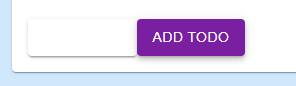
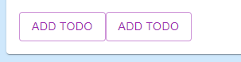

# 问题

### 运行出现的问题

#### 按钮显示错误

```tsx
<Button
    variant='contained'
    color='secondary'
    >
    Add Todo
</Button>
<Button
    variant='contained'
    color='secondary'
    >
    Add Todo
</Button>
```



当 `Button` 样式为 `contained` 时, 必须悬浮过去才能正确显示

可以通过修改为 `outlined` 来正确显示



```tsx
<Button
    variant='outlined'
    color='secondary'
    >
    Add Todo
</Button>
<Button
    variant='outlined'
    color='secondary'
    >
    Add Todo
</Button>
```


### 打包出现的问题

#### 带 `api`目录打包

如果带 `api` 目录打包, 会出现问题

```
> Build error occurred
[Error: EPERM: operation not permitted, copyfile 'D:\WEB-Code\Nextjs\nextjs-all-in-one\.next\server\app\api.body' -> 'D:\WEB-Code\Nextjs\nextjs-all-in-one\out\api'] {
  errno: -4048,
  code: 'EPERM',
  syscall: 'copyfile',
  path: 'D:\\WEB-Code\\Nextjs\\nextjs-all-in-one\\.next\\server\\app\\api.body',
  dest: 'D:\\WEB-Code\\Nextjs\\nextjs-all-in-one\\out\\api'
}
```tsx
```
把 `api` 目录移走,能顺利打包
```tsx
- info Generating static pages (33/33)
- info Finalizing page optimization

Route (app)                                                         Size     First Load JS
┌ ○ /                                                               199 B          82.9 kB
├ ○ /favicon.ico                                                    0 B                0 B
├ ○ /login                                                          11 kB           185 kB
├ ○ /login/success                                                  3.61 kB         138 kB
├ ○ /nested-directory                                               1.06 kB        83.7 kB
├ ○ /nested-menus                                                   8.82 kB         114 kB
├ ○ /react-hook-form                                                199 B          82.9 kB
├ ○ /react-hook-form/API                                            200 B          82.9 kB
├ ○ /react-hook-form/GET-STARTED                                    199 B          82.9 kB
├ ○ /react-hook-form/GET-STARTED/01-quick-start                     1.12 kB        86.3 kB
├ ○ /react-hook-form/GET-STARTED/02-register-fields                 937 B          86.1 kB
├ ○ /react-hook-form/GET-STARTED/03-apply-validation                1.07 kB        86.2 kB
├ ○ /react-hook-form/GET-STARTED/04-integrating-existing-form       1.02 kB        86.2 kB
├ ○ /react-hook-form/GET-STARTED/05-integrating-UI-libraries        24.1 kB         165 kB
├ ○ /react-hook-form/GET-STARTED/06-intergrating-controlled-inputs  3.36 kB         115 kB
├ ○ /react-hook-form/GET-STARTED/07-handle-errors                   882 B            86 kB
├ ○ /react-hook-form/GET-STARTED/08-schema-validation               12.2 kB        97.4 kB
├ ○ /react-hook-form/GET-STARTED/09-typescript                      920 B          86.1 kB
├ ○ /react-query                                                    199 B          82.9 kB
├ ○ /react-query/overview                                           3.71 kB         113 kB
├ ○ /react-query/quick-start                                        7.84 kB         127 kB
├ ○ /test                                                           199 B          82.9 kB
├ ○ /test-login                                                     4.48 kB         166 kB
├ ○ /test-readDir                                                   200 B          82.9 kB
├ ○ /test-readDir/one                                               212 B          77.2 kB
├ ○ /test-readDir/two                                               212 B          77.2 kB
├ ○ /test/test-clickableChips                                       5.03 kB         109 kB
├ ○ /test/test-context                                              1.06 kB        78.1 kB
├ ○ /test/test-dialog                                               4.92 kB         121 kB
├ ○ /test/test-swiper                                               26.1 kB         130 kB
└ ○ /todos                                                          20.4 kB         168 kB
+ First Load JS shared by all                                       77 kB
  ├ chunks/1216-fdad65e6024bcbf9.js                                 24.6 kB
  ├ chunks/b026e9af-a1f6a0863c6af396.js                             50.5 kB
  ├ chunks/main-app-76581a376d6b88c2.js                             216 B
  └ chunks/webpack-186d3547d6de720e.js                              1.71 kB

Route (pages)                                                       Size     First Load JS
─ ○ /404                                                            180 B          86.1 kB
+ First Load JS shared by all                                       85.9 kB
  ├ chunks/main-e26da196049f3b93.js                                 84 kB
  ├ chunks/pages/_app-3e0e6b963311da93.js                           193 B
  └ chunks/webpack-186d3547d6de720e.js                              1.71 kB

○  (Static)  automatically rendered as static HTML (uses no initial props)
```

#### `Image`/`img`标签打包后的问题

打包前:

```tsx
const imageData = [
    'https://images.unsplash.com/photo-1599394022918-6c2776530abb?ixlib=rb-1.2.1&ixid=eyJhcHBfaWQiOjEyMDd9&auto=format&fit=crop&w=1458&q=80',
    'https://images.unsplash.com/photo-1593642632559-0c6d3fc62b89?ixlib=rb-1.2.1&ixid=eyJhcHBfaWQiOjEyMDd9&auto=format&fit=crop&w=1500&q=80',
    'https://images.unsplash.com/photo-1599423300746-b62533397364?ixlib=rb-1.2.1&ixid=eyJhcHBfaWQiOjEyMDd9&auto=format&fit=crop&w=1500&q=80',
    'https://images.unsplash.com/photo-1599561046251-bfb9465b4c44?ixlib=rb-1.2.1&ixid=eyJhcHBfaWQiOjEyMDd9&auto=format&fit=crop&w=1492&q=80',
]

export default imageData


{imageList.length > 0 &&
    imageList.map((image) => (
    <Image
        className='w-125 h-125 bg-cover'
        key={image.id}
        src={image.src}
        alt={image.desc}
        />
))}
```

打包后:

```tsx

```

# 更新

## 2023/10/30

### Supplement the request.spec.ts

- test needs the open api from 'https://jsonplaceholder.typicode.com/albums'

- the request interceptor should operate based on the container is browser or not 

  

### jest-dom & msw

#### replace the jest.config.js 

```js
const nextJest = require('next/jest')

const createJestConfig = nextJest({
  // Provide the path to your Next.js app to load next.config.js and .env files in your test environment
  dir: './',
})

// Add any custom config to be passed to Jest
const customJestConfig = {
  setupFilesAfterEnv: ['<rootDir>/jest.setup.js'],
  testEnvironment: 'jest-environment-jsdom',
}

// createJestConfig is exported this way to ensure that next/jest can load the Next.js config which is async
module.exports = createJestConfig(customJestConfig)

```

#### init the jest.setup.js

```js
// Learn more: https://github.com/testing-library/jest-dom
import '@testing-library/jest-dom';
import 'whatwg-fetch'
import { TextEncoder } from 'util';

global.TextEncoder = TextEncoder;

```

#### install packages 

`pnpm i jest-environment-jsdom @testing-library/jest-dom @testing-library/user-event msw@1.3.2  whatwg-fetch`

#### write demos based on the document 

url : `https://www.npmjs.com/search?q=%40testing-library%20`

@testing-library/react : `https://www.npmjs.com/package/@testing-library/react`

@testing-library/jest-dom: `https://www.npmjs.com/package/@testing-library/jest-dom`

@testing-library/user-event: `https://www.npmjs.com/package/@testing-library/user-event`
